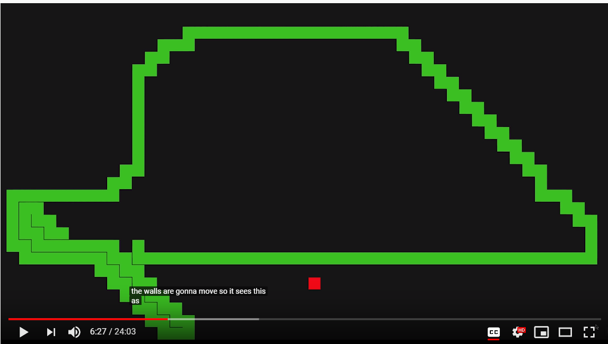

# Use AI to solve snake

## Genetic Algorithm and Deep Learning

* ref: 
  * <https://www.youtube.com/watch?v=zIkBYwdkuTk>
  * <https://github.com/greerviau/SnakeAI>
  * <https://chrispresso.coffee/2019/09/22/ai-learns-to-play-snake/>
  * <https://www.youtube.com/watch?v=vhiO4WsHA6c>

* Deep Neuron network Architecture
  * 24 input neurons, 2*18 hidden neurons and 4 output neurons
  * Input: snake check 8 directions, each direction sees the distance between it and the food block (if it is in that direction), the distance between it and the wall and its tail(3*8)
  * Output: 4 direction it should go next
* Evolution
  * Each generation 2000 snakes are created.
  * First generation, randomly initialize all snakes
  * Once the entire population is dead, a fitness score is calculated for each of the snakes. Using these fitness scores, some of the **best snakes are selected to reproduce**. In reproduction two snakes are selected and the **neural nets of each are crossed** and then the resulting child is mutated(变异). This is repeated to create a new population of 2000 new snakes.
  * Fitness score: how long the snake stays alive as well as its score, weighted on each perspective(high score has a higher weight => otherwise endless loop)
  * To avoid loop: Every time it eats a piece of food it gains 100 more moves, with a maximum of 500 moves. This means that snakes who evolve to go in loops will eventually die and snakes who go for the food will not only have a higher score, but stay alive longer.
  * Cross of neural network: 
    * part of one parents brain is mixed with part of the second parents and the resulting brain is assigned to the child. 
    * After the crossover the brain is also mutated according to a mutation rate. The mutation rate determines how much of the brain will be randomly altered.

## Fusion to build a team

* ref: 
  * <https://www.youtube.com/watch?v=3bhP7zulFfY>
  * <https://github.com/Code-Bullet/SnakeFusion>
* Pick a list of top players in all the AI trained previously, each one has some special features: some has a unique path of movement, some is good at avoiding collision to wall and itself, some moves quick to the target, some gets a high score
* Image what each snake wants to do and pick the best one to follow
* Three states (Finite state machine):
  * green: find the food and moving to it
  * blue: foreseen it is close to the food and 
  * white: do not know where the food is and just move to keep alive

## Deep Q Learning

* ref: 
  * <https://www.youtube.com/watch?v=-NJ9frfAWRo>
* Input: 
  * All pixels from the current screen (60*60) => It doesn’t know the previous position (head, tail)
  * Two screen one before one after (2\*60\*60) => two many inputs will make the network converge slowly
  * Shrink the area the snake can see (20*20 centered by the snake’s head) 
* Reinforcement learning
  * Punish AI whenever it is died
  * Reward AI whenever it gets the food

## Shortest/Longest path, A* algorithm

* Transfer the snake into a maze problem with wall moving

* Methods:

  * Generate all possible paths, and generate one => computational expensive

  * A* algorithm shortest path

    * Before get the food, need to find the best path to get the food, still need to check many paths

    * For following situation

      

      * The algorithm assume wall is not moving, it will assume tail is there and try to avoid it
      * It will give up when trapped in a circle

  * A* algorithm longest path => it will turn many times and trap itself

  * A* algorithm longest path + at all times the head of the snake must be able to reach at least 80% of the empty blocks => discarding any paths which get the snake trapped is that sometimes discard all possible paths

  * A* algorithm longest path + at all times the head of the snake must be able to reach at least 80% of the empty blocks + in the mode trapped enter survival mode (don’t care where the apple is, simply to survive)

## Close form solution: Hamiltonian cycle

* Think snake as a grid of blocks， Hamiltonian cycle is the cycle pass each of the node exactly once
* For some cases, it can go a shortcut, but notice these cases
  * Cut off any areas which contain the part of the tail
  * Careful when the snake get the apple and expand

----------------

Other ref: 

<https://www.pantechsolutions.net/ai-snake-game-design-using-machine-learning>

<https://becominghuman.ai/designing-ai-solving-snake-with-evolution-f3dd6a9da867>